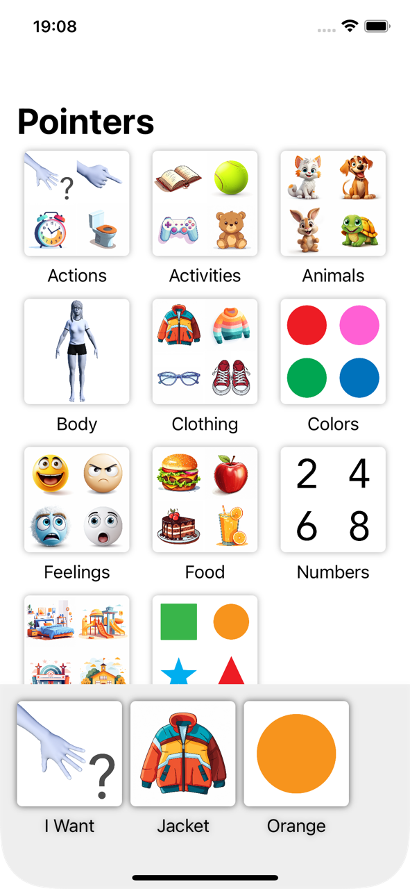
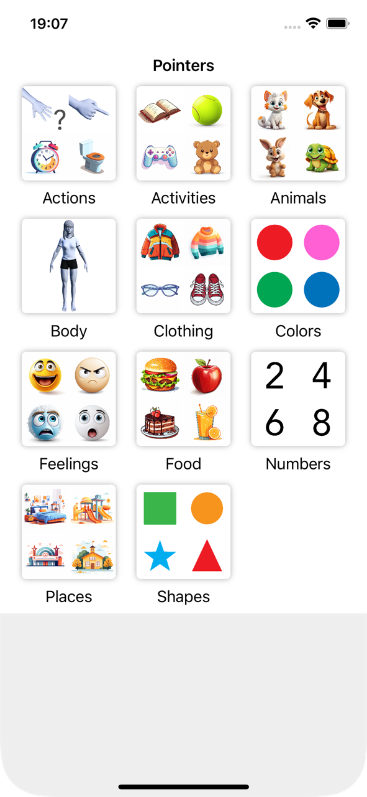
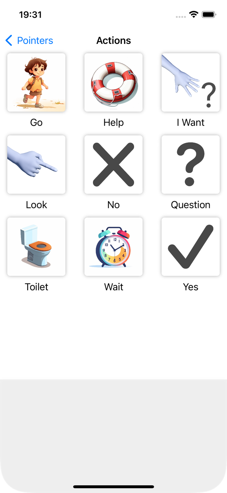
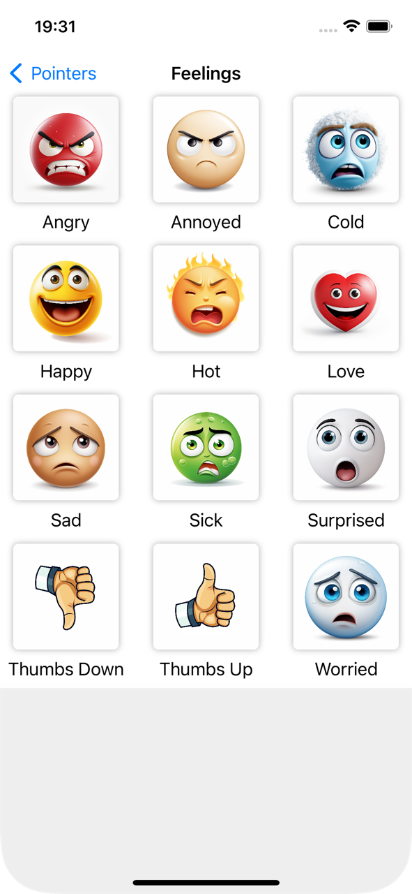

# Pointers

A simple iOS app that allows disabled people with speech problems to express themselves with
express themselves with their fingers and symbol images from different categories.

Implemented along the [HWS+](https://www.hackingwithswift.com/plus/) live stream by Paul Hudson.

## Screenshots

  

  